# Game Architecture - UML Diagram

The following diagram outlines the high-level architecture of the Wildfire Management Game, illustrating the relationships between the Presentation Layer, Business Logic, Game State, and Persistence.

```mermaid
classDiagram

    class PlayerProgression {
        -int currentLevel
        -int currentScore
        -List~String~ unlockedFeatures
    }

    namespace Presentation {
        class StartMenu {
            +triggerNewGame()
            +triggerLoadGame()
            +triggerSettings()
            +triggerExit()
        }
        class UIManager {
            +UpdateBudgetDisplay()
            +UpdateReputationDisplay()
            +UpdateProgressionDisplay()
            +ShowAlert(message)
            +ShowPolicyPanel()
            +ShowDeploymentPanel()
            +showPauseMenu()
            +showFinalResult(event)
        }
        class TileRenderer {
            +RenderIsometricSprite()
            +PlayFireVFX()
            +PlayExtinguishVFX()
        }
    }

    class EventBroker {
        <<Singleton>>
        -instance : EventBroker
        +subscribe(eventType)
        +unsubscribe(eventType)
        +publish(eventData)
    }

    namespace Scriptable_Objects {
        class PolicyConfig {
            -float spreadReductionModifier
            -int costToImplement
            -int requiredLevel
        }
        class UnitConfig {
            -int deploymentCost
            -int maxWaterCapacity
            -float moveSpeed
            -float extinguishRate
        }
        class BiomeConfig {
            -float spreadMultiplier
            -float baseMoisture
            -Sprite defaultSprite
            -Sprite burningSprite
        }
    }

    namespace Business_Logic {
        class GameManager {
            +StartGame()
            +PauseGame()
            +ResumeGame()
            +EndGame()
        }
        class FireEngine {
            -bool isRunning
            -float fireTickTimer
            +CalculateSpread()
            +Tick()
            +Pause()
            +Resume()
        }
        class ResourceManager {
            -int globalAvailableBudget
            +moveEntity(id : ID, category : Category, amount : int)
            +deployUnit(id : ID, unitType, refType)
            +transferResources(fromCity : City, toCity : City, amount : int)
            +trackAvailableResources()
        }
        class PolicyManager {
            +addPolicy(policyType, region : Region)
            +removePolicyFromEngine(policyName)
            +calculatePolicyEffect(policy, region : Region) float
        }
        class ProgressionManager {
            +addToScore()
            +checkScore()
            +getCurrentScore() int
            +calculateProgressionLevel(topic) bool
        }
        class ScoringSystem {
            +findHighestScoredTopic(topic, func)
            +calculateScore(responseTime : float)
            +findProgress() bool
        }
        class MapGenerator {
            +generateWithReference()
        }
        class WeatherSystem {
            -Vector2 currentWindDirection
            -float windSpeed
            +getNextWindDirection()
            +getWindSpeed()
            +isValid()
            +updateWeatherState()
        }
        class ReputationManager {
            +updateReputation(city : City, scoreType, level)
            +getLocalReputation()
            +calculateNextReputation(level, city1 : City, city2 : City)
        }
        class AutoSaveController {
            -float autoSaveInterval
            +run()
            +triggerAutoSave()
        }
    }

    namespace Persistence {
        class SaveManager {
            -String filePathGameFolder
            +loadFile(item) : FileName
            +saveFile() : FileName
            +transferItems()
        }
        class IStorageProvider {
            <<interface>>
            +load()
            +store()
        }
        class LocalFileProvider {
            -bool usingConnect
            +connect()
            +serialize()
        }
        class DatabaseProvider {
            -bool usingConnect
            -int count
            +load()
            +store()
            +hardReloadOrDeleteCurrentCopy()
        }
    }

    namespace Game_State {
        class City {
            -String name
            -int budget
            -int reputation
            -bool isOnFire
        }
        class ActiveResponseUnit {
            -Vector2 currentLocation
            -int currentWater
            -UnitState state
        }
        class Tile {
            -Vector2 coordinates
            -bool isOnFire
            -float fireIntensity
            -float moistureLevel
        }
        class Region {
            -String name
            -List~City~ cities
            +GetTiles() List~Tile~
        }
        class GridSystem {
            -int width
            -int height
            -Tile[,] gridArray
            +GetTileAt(x, y) Tile
            +GetNeightbours(Tile) List~Tile~
        }
    }

    %% --- Relationships ---

    %% Presentation Layer
    StartMenu ..> EventBroker : publishes
    UIManager ..> EventBroker : subscribes
    UIManager ..> PlayerProgression : reads
    TileRenderer ..> EventBroker : subscribes

    %% Game Manager Connections
    GameManager --> ResourceManager : manages
    GameManager --> MapGenerator : triggers_generation
    GameManager --> WeatherSystem : controls
    GameManager --> FireEngine : controls_lifecycle
    GameManager ..> EventBroker : subscribes

    %% Resource Manager Connections
    ResourceManager ..> EventBroker : publishes & subscribes
    ResourceManager --> ProgressionManager : updates
    ResourceManager ..> City : modifies_resources
    ResourceManager ..> ActiveResponseUnit : deploys
    ResourceManager ..> PlayerProgression : checks_unlocks

    %% Policy Manager Connections
    PolicyManager ..> PolicyConfig : reads
    PolicyManager ..> EventBroker : publishes
    PolicyManager ..> Region : applies_to
    PolicyManager ..> PlayerProgression : checks_level

    %% Progression Manager Connections
    ProgressionManager ..> PlayerProgression : updates
    
    %% Scoring System Connections
    ScoringSystem ..> EventBroker : subscribes
    ScoringSystem ..> Tile : reads fire damage
    ScoringSystem ..> City : evaluates

    %% Map Generator Connections
    MapGenerator ..> GridSystem : populates

    %% Reputation Manager Connections
    ReputationManager ..> FireEngine : trigger escalation
    ReputationManager ..> EventBroker : subscribes
    ReputationManager ..> City : modifies reputation

    %% AutoSave Controller Connections
    AutoSaveController ..> PlayerProgression : reads_state
    AutoSaveController ..> GridSystem : reads_state
    AutoSaveController --> SaveManager : triggers

    %% Fire Engine Connections
    FireEngine ..> WeatherSystem : reads_wind_&_season
    FireEngine ..> EventBroker : publishes & subscribes
    FireEngine ..> Tile : reads & modifies
    
    %% Game_State internal & Scriptable Objects 
    ActiveResponseUnit ..> UnitConfig : reads
    Tile ..> BiomeConfig : reads

    %% Persistence
    SaveManager --> IStorageProvider : uses
    IStorageProvider <|-- LocalFileProvider
    IStorageProvider <|-- DatabaseProvider
    
    SaveManager ..> PlayerProgression : serializes
    SaveManager ..> GridSystem : serializes
    SaveManager ..> Region : serializes cities & units

    %% Game_State internal (COMPOSITION)
    City "1" *-- "*" ActiveResponseUnit : owns
    Tile "1" *-- "0..1" City : contains
    Region "1" *-- "1..*" City : owns
    GridSystem "1" *-- "1..*" Region : groups
```

